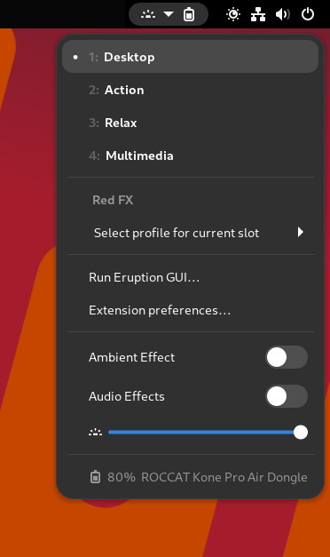
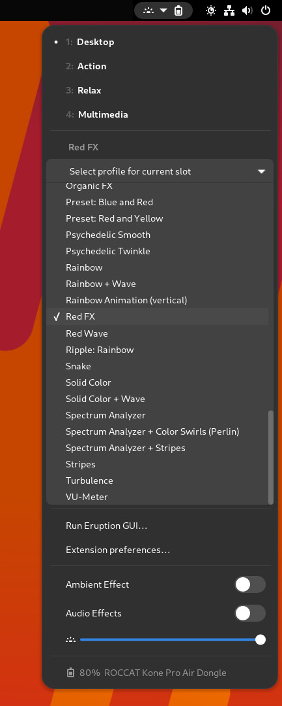

# Eruption Profile Switcher

A GNOME 40 Shell extension that can be used to switch between different
slots and profiles of the [`Eruption`](https://github.com/X3n0m0rph59/eruption)
Linux input and LED driver for keyboards, mice and other devices.

Additionally, it supports setting some global configuration options like
brightness of the keyboard, and it allows to enable or disable sound effects.
It even supports showing signal strength and battery levels where applicable.

